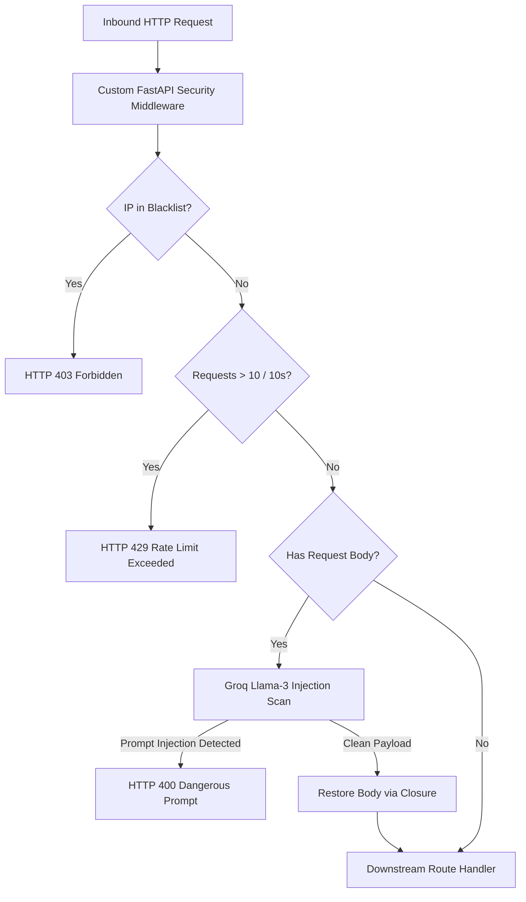

# 🛡️ Orovo: Lightweight Cyber WAF & AI Gateway

> **FastAPI-powered security middleware prototype featuring active honeypot detection, sliding-window rate limiting, and Groq LLM prompt injection screening.**

[](https://fastapi.tiangolo.com)
[](https://python.org)
[](https://groq.com)
[](https://stripe.com)

---

## 🌟 What It Does

Orovo is a lightweight Web Application Firewall (WAF) and API gateway prototype designed to intercept malicious traffic before it reaches downstream web applications. It implements three core defensive mechanisms:
1. **Decoy Honeypots:** Traps automated scanners probing for sensitive configuration files (`/.env.backup`) and instantly blacklists offending IP addresses.
2. **Sliding-Window Rate Limiting:** Restricts client request velocities to prevent brute-force attacks.
3. **LLM Prompt Injection Classifier:** Passes inbound POST request payloads to Groq's high-speed Llama-3 model for sub-second binary injection classification.

---

## 🏗️ Architecture & Request Flow



---

## 🔒 Technical Highlights

- **Stream Replay Closure:** Intercepting request bodies in ASGI middleware normally exhausts the async stream; Orovo captures the body bytes and constructs a synthetic `_receive` closure so downstream handlers can parse JSON bodies without errors.
- **Honeypot Blacklisting:** Immediate O(1) in-memory rejection of repeat attackers accessing known honeypot traps.
- **Stripe Webhook Signature Verification:** Cryptographic HMAC signature construction preventing unpaid entitlement bypasses.

---

## 🚀 Running Locally

```bash
# 1. Install dependencies
pip install -r requirements.txt

# 2. Set environment variables
export GROQ_API_KEY="your_groq_api_key"
export STRIPE_SECRET_KEY="your_stripe_secret_key"
export STRIPE_WEBHOOK_SECRET="your_stripe_webhook_secret"

# 3. Start Uvicorn server
uvicorn app:app --reload --port 8000
```

---

## 📊 Status & Roadmap

- **Status:** `Proof of Concept / Prototype` — Core FastAPI middleware, Groq screening, and honeypot routes verified.
- **Roadmap:**
  - [ ] Migrate in-memory rate limiter to distributed Redis sliding-window logs.
  - [ ] Implement ASN-based geo-blocking.
  - [ ] Add Prometheus latency & threat telemetry metrics exporter.

